Option pages should be easy to make given a structure of your options, and look like Chrome's options.

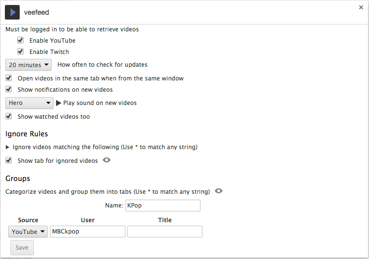

Screenshot is from extension [veefeed](https://github.com/fent/chrome-veefeed)

Here's a [demo](https://fent.github.io/chrome-options/).

This library uses [chrome-bootstrap](https://github.com/better-history/chrome-bootstrap) for styling.

# Install

Recommended that you create an options folder in your extension, for organization purposes.

    bower install chrome-options
    ln -s bower_components/chrome-options/options.html .
    touch custom.css
    touch options.js

Add options page to `manifest.json`. `open_in_tab` set to `true` or `false` are both supported.

    "options_ui": {
      "page": "options/options.html",
      "open_in_tab": false
    }

Also needs `storage` permission. Options are saved to [`chrome.storage.sync`](https://developer.chrome.com/extensions/storage#property-sync).

    "permissions": [
      "storage"
    ]

If you'll be using the [predefined_sound](#predefined_sound) fields, and want to play sounds from a content script, also add

    "web_accessible_resources": [
      "options/bower_components/chrome-options/sounds/*.wav"
    ]

If you're using git, consider adding `options/bower_components` to your `.gitignore`.

Afterwards, you can start setting up your options page by editing `options.js`, and additionally, `custom.css` if you need to set any styles.

# Setup

Use only one of the following functions to setup your options. If you're planning on using multi tab form, use `chrome.options.addTab()`, called once for each tab. Otherwise, use `chrome.options.set()`.

### `chrome.options.set([description], options)`
* `description` - Will be displayed at the top of the page.
* `options` - List of options.

### `chrome.options.addTab(name, [description], options)`
* `String` - `name` - Name of the tab. Will be prepended along with "." to each option's name that's displayed under this tab.
* `String` - `description` - Will be placed on top of the page when tab is viewed.
* `Array.<Object>` - `options` - List of options.

Options all can have the following properties.

* `String` - `type` - What type of option this is. Defaults to "checkbox".
* `String` - `name` - Required. What to save the key as. Also used as class name to add to field containers, in case you'd like to style it further.
* `String` - `description`
* `String` - `preview` - A preview image. Represents the extension of the image, example "png". If this is used, the image must be placed in a `previews` folder where `options.html` is, and named the name as this option's key, which is its name prepended by tab name if any.
* `Object` - `default` - Default value.
* `Boolean` - `disabled` - The field can be disabled, for whatever reason...
* `Boolean` - `singleline` - If you'd like to position the label and the field on the same line, instead of the default multiline layout.
* `Function` - `validate` - Will be given the new value of the field, will only save if it returns `true`.

# Fields Types Available

### checkbox

### text

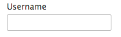

### color

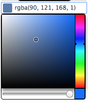

* `String` - `format` - Can be `hex`, `rgb`, `rgba`, `hsl`, or `hsla.`.

If `default` is set, will have an additional button for resetting to that color.

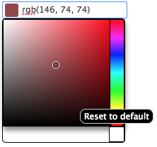

Uses [this color picker library](https://github.com/tovic/color-picker).

### select

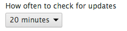

* `Array.<Object|String>` - `options` - List of options for this field. If a list of objects, each option must have `value` and `desc` properties. `value` can be a string or int.

### radio

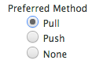

* `Array.<Object|String>` - `options` - List of options for this field. If a list of objects, each option must have `value` and `desc` properties.

### predefined_sound

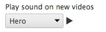

* `Boolean` - `allowNoSound` - Adds a no sound option to the top of the select field.

### custom_sound

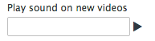

# Complex Field Types

### checkbox

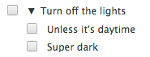

* `Array.<Object>` - `options` - Checkboxes can additionally have an `options` property with a list of options.

When saved, will be saved as an object with all option names as keys along with their values. Object will include an `enabled` property, set to `true` when the checkbox is checked.

### object

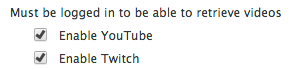

* `Array.<Object>` - `options`
* `String` - `layout` - "column" or "row". Defaults to "column".

Similar to checkbox with `options`, but without the checkbox. Not just for aesthetic purposes, will still be saved as an object.

### list

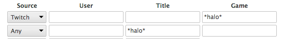

* `Array.<Object>` - `fields` - Required. List of fields for this list.
  * `String` - `type` - Only basic field types listed above and custom fields supported.
  * `String` - `name` - Required for non-layout types.
  * `Boolean` - `required` - Set to true if you require this particular field to be a truthy value for this row to be saved.
  * `Object` - `bindTo` - Will only display this field if another field with name matching `bindTo.field` has the value `bindTo.value`, which can be be a string or an array of strings.
* `Boolean` - `head` - True if you want to display table headings. Requires fields to have `desc` properties.
* `Boolean` - `sortable` - True if you'd like users to be able to drag and reorder rows around.
* `Boolean` - `collapsible` - True if you want the table's content to be collapsible. `desc` recommended.
* `Array.<Option>` - `first` - You can specify a different set of fields for the first row.

Will save its value as an array. If there is only one field, it will be an array of values of that field. Otherwise, an array of objects. When the last row's value is changed, a new row will be added.

### [field]-list

Shortcut for a single field list.

### checkbox-[field]

Shortcut for a checkbox with a field right next to it.

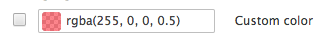

* `Boolean` - `defaultEnabled`
* `Object` - `defaultValue`

Saved as an object, `enabled` set to `true` when the checkbox is checked, and `value` set to the field's value.

# Layout Fields

Use these to help structure the layout of your page.

### h3

* `String` - `desc` - Text contents.

A heading that can be used as a separator.

### column/row

* `Array.<Object>` - `options` - List of options.

Places options in a column/row structure. Unlike the object type, does not save each option in a separate object, but on the parent object.

### html

* `DOMNode|String` - `html` - Contents.

Places HTML content directly into the page.

# Custom Fields

You can add custom containers with multiple fields, other types of form fields that are not yet supported, or change current fields to use your preferred libraries.

Current basic type of fields can be accessed through `chrome.options.fields`. They're functions that are called with

* `Object` - The current value of this option.
* `Function` - Should be called with new value when this option is updated, and the event object if any.
* `Object` - The object describing this option.

You can add your own to this object, [here's an example](https://github.com/fent/chrome-veefeed/blob/v0.1.1/options/options.js#L19) that creates a custom field that represents a text field and a list, which can be used inside a list.

To use one of the already existing basic fields with your custom field, you can call the following functions.

`chrome.options.addField(value, save, option)`
`chrome.options.addLabelNField(value, save, option)`

# Options

A few options are supported.

* `chrome.options.opts.title` - Title of the page if opening the page in a new tab. If not set, will set thet title to the extension's name from the manifest. Set to `false` if you don't want a title displayed.
* `chrome.options.opts.about` - Contents of the About tab. If not set, will set the contents to the extension's description from the manifest. Can be an html string. Set to `false` if you don't want this tab at all.
* `chrome.options.opts.autoSave` - If `true`, will save options as they are changed. Otherwise, a button will be shown on the bottom left of the page for saving. Defaults to `true`.
* `chrome.options.opts.saveDefaults` - If `true`, will save any options that have defaults set, if those options have never been saved before. Can be useful if you only want to keep defaults in your options page, and not in background and/or content pages for when your extension is first installed. Defaults to `true`.

# Embed Options Page

In case you'd like to embed your option page, or part of it, inside a browser action, page action, or another page, you can do so with an iframe. You can get the option page url with `chrome.runtime.getURL("/options/options.html")`.

You can use the following query parameters to help you customize what specifically you want users to see.

* `hideTitle` - Hides the extension title on the top left.
* `hideAbout` - Hides about tab.
* `hideSidebar` - Hides entire sidebar, including title and about tab.
* `hideTabTitle` - Hides the selected tab's title.
* `hideTabDesc` - Hides the selected tab's description.

You can also choose to display one option, suboption, or part of an option, by specifying it in the hash.

    /options.html?#general.my_option

# Roadmap

* Additional fields as needed.
  * Number
  * Slider
  * Date picker
  * file upload
  * image upload
* Build and minimize release
  * Optionally include sound files in installation
